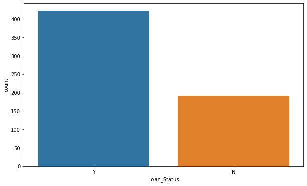
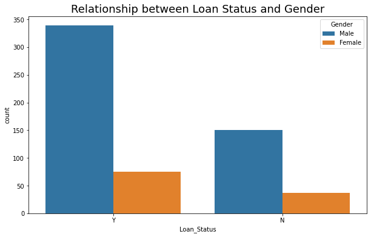
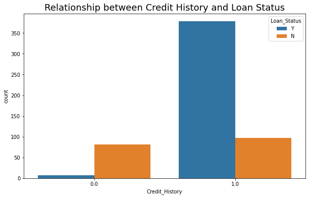
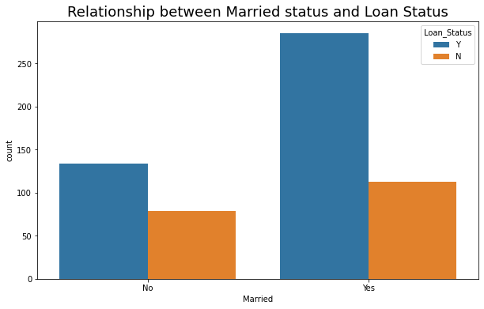
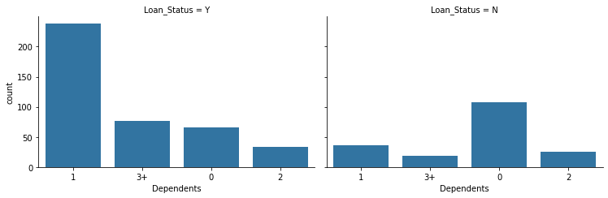
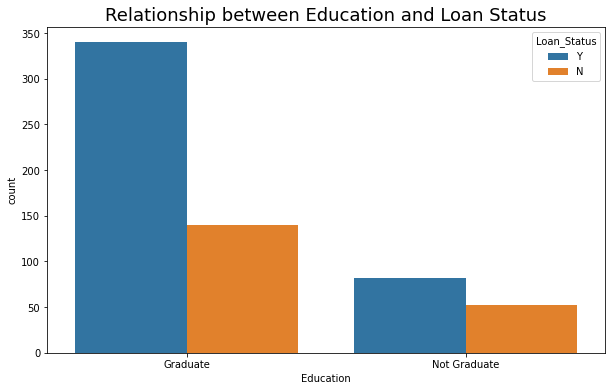
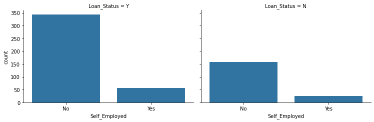
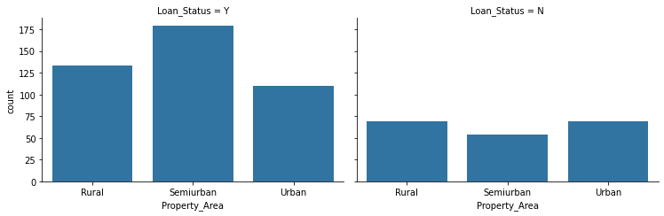
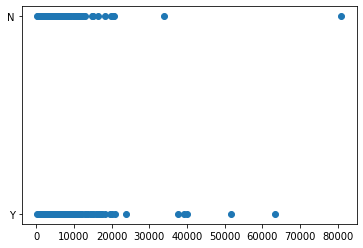

***CONTENTS*** <br>

- Intorduction

- Data Collection

- Data Preprocessing

- Data Splitting

- Model Implementation

- Model Evaluation

# Intorduction

In this project we have create a Machine Learning Model based on given information to predict whether or not loan will get approved.


**What we will do?**

- Visualize and compare the data.

- Pre-processing of data.

- Handling Missing Value.

- Analyze Categorical and Numerical Data.

- Outliers Detection

- Different Machine Learning Algorithms and Evaluation Matrices for evaluation.


**What we will Use?**

- Different Python Libraries such as `sklearn`,`matplotlib`,`numpy`,`seaborn`.

- Different Machine Learning Algorithm for Prediction Model and select best of them--

    - Logisctic Regression
    
    - KNeighbors Classifier
    
    - Support Vecort Machine(SVC)
    
    - DecisionTreeClassifier
    
 **NOTE:** I, Ukant doing this project under my Data Science Internship at CodeClause. Currently studying and learning about this field, so if there is any mistake I have made, please feel free comment below.


```python
# Importing some libraries
import numpy as np
import pandas as pd
import matplotlib.pyplot as plt
import seaborn as sns

import warnings 
warnings.filterwarnings('ignore')
```

# Data Disscussion and Collection


```python
df_train = pd.read_csv("../Data/train_u6lujuX_CVtuZ9i.csv")
df_test = pd.read_csv("../Data/test_Y3wMUE5_7gLdaTN.csv")
```


```python
# Shape of data
print(df_train.shape)
print(df_test.shape)
```

    (614, 13)
    (367, 12)
    


```python
df_train.head()
```


<div>
<style scoped>
    .dataframe tbody tr th:only-of-type {
        vertical-align: middle;
    }

    .dataframe tbody tr th {
        vertical-align: top;
    }

    .dataframe thead th {
        text-align: right;
    }
</style>
<table border="1" class="dataframe">
  <thead>
    <tr style="text-align: right;">
      <th></th>
      <th>Loan_ID</th>
      <th>Gender</th>
      <th>Married</th>
      <th>Dependents</th>
      <th>Education</th>
      <th>Self_Employed</th>
      <th>ApplicantIncome</th>
      <th>CoapplicantIncome</th>
      <th>LoanAmount</th>
      <th>Loan_Amount_Term</th>
      <th>Credit_History</th>
      <th>Property_Area</th>
      <th>Loan_Status</th>
    </tr>
  </thead>
  <tbody>
    <tr>
      <th>0</th>
      <td>LP001002</td>
      <td>Male</td>
      <td>No</td>
      <td>0</td>
      <td>Graduate</td>
      <td>No</td>
      <td>5849</td>
      <td>0.0</td>
      <td>NaN</td>
      <td>360.0</td>
      <td>1.0</td>
      <td>Urban</td>
      <td>Y</td>
    </tr>
    <tr>
      <th>1</th>
      <td>LP001003</td>
      <td>Male</td>
      <td>Yes</td>
      <td>1</td>
      <td>Graduate</td>
      <td>No</td>
      <td>4583</td>
      <td>1508.0</td>
      <td>128.0</td>
      <td>360.0</td>
      <td>1.0</td>
      <td>Rural</td>
      <td>N</td>
    </tr>
    <tr>
      <th>2</th>
      <td>LP001005</td>
      <td>Male</td>
      <td>Yes</td>
      <td>0</td>
      <td>Graduate</td>
      <td>Yes</td>
      <td>3000</td>
      <td>0.0</td>
      <td>66.0</td>
      <td>360.0</td>
      <td>1.0</td>
      <td>Urban</td>
      <td>Y</td>
    </tr>
    <tr>
      <th>3</th>
      <td>LP001006</td>
      <td>Male</td>
      <td>Yes</td>
      <td>0</td>
      <td>Not Graduate</td>
      <td>No</td>
      <td>2583</td>
      <td>2358.0</td>
      <td>120.0</td>
      <td>360.0</td>
      <td>1.0</td>
      <td>Urban</td>
      <td>Y</td>
    </tr>
    <tr>
      <th>4</th>
      <td>LP001008</td>
      <td>Male</td>
      <td>No</td>
      <td>0</td>
      <td>Graduate</td>
      <td>No</td>
      <td>6000</td>
      <td>0.0</td>
      <td>141.0</td>
      <td>360.0</td>
      <td>1.0</td>
      <td>Urban</td>
      <td>Y</td>
    </tr>
  </tbody>
</table>
</div>


```python
df_test.head()
```


<div>
<style scoped>
    .dataframe tbody tr th:only-of-type {
        vertical-align: middle;
    }

    .dataframe tbody tr th {
        vertical-align: top;
    }

    .dataframe thead th {
        text-align: right;
    }
</style>
<table border="1" class="dataframe">
  <thead>
    <tr style="text-align: right;">
      <th></th>
      <th>Loan_ID</th>
      <th>Gender</th>
      <th>Married</th>
      <th>Dependents</th>
      <th>Education</th>
      <th>Self_Employed</th>
      <th>ApplicantIncome</th>
      <th>CoapplicantIncome</th>
      <th>LoanAmount</th>
      <th>Loan_Amount_Term</th>
      <th>Credit_History</th>
      <th>Property_Area</th>
    </tr>
  </thead>
  <tbody>
    <tr>
      <th>0</th>
      <td>LP001015</td>
      <td>Male</td>
      <td>Yes</td>
      <td>0</td>
      <td>Graduate</td>
      <td>No</td>
      <td>5720</td>
      <td>0</td>
      <td>110.0</td>
      <td>360.0</td>
      <td>1.0</td>
      <td>Urban</td>
    </tr>
    <tr>
      <th>1</th>
      <td>LP001022</td>
      <td>Male</td>
      <td>Yes</td>
      <td>1</td>
      <td>Graduate</td>
      <td>No</td>
      <td>3076</td>
      <td>1500</td>
      <td>126.0</td>
      <td>360.0</td>
      <td>1.0</td>
      <td>Urban</td>
    </tr>
    <tr>
      <th>2</th>
      <td>LP001031</td>
      <td>Male</td>
      <td>Yes</td>
      <td>2</td>
      <td>Graduate</td>
      <td>No</td>
      <td>5000</td>
      <td>1800</td>
      <td>208.0</td>
      <td>360.0</td>
      <td>1.0</td>
      <td>Urban</td>
    </tr>
    <tr>
      <th>3</th>
      <td>LP001035</td>
      <td>Male</td>
      <td>Yes</td>
      <td>2</td>
      <td>Graduate</td>
      <td>No</td>
      <td>2340</td>
      <td>2546</td>
      <td>100.0</td>
      <td>360.0</td>
      <td>NaN</td>
      <td>Urban</td>
    </tr>
    <tr>
      <th>4</th>
      <td>LP001051</td>
      <td>Male</td>
      <td>No</td>
      <td>0</td>
      <td>Not Graduate</td>
      <td>No</td>
      <td>3276</td>
      <td>0</td>
      <td>78.0</td>
      <td>360.0</td>
      <td>1.0</td>
      <td>Urban</td>
    </tr>
  </tbody>
</table>
</div>


```python
# Stastical Summary of Continous data
df_train.describe()
```


<div>
<style scoped>
    .dataframe tbody tr th:only-of-type {
        vertical-align: middle;
    }

    .dataframe tbody tr th {
        vertical-align: top;
    }

    .dataframe thead th {
        text-align: right;
    }
</style>
<table border="1" class="dataframe">
  <thead>
    <tr style="text-align: right;">
      <th></th>
      <th>ApplicantIncome</th>
      <th>CoapplicantIncome</th>
      <th>LoanAmount</th>
      <th>Loan_Amount_Term</th>
      <th>Credit_History</th>
    </tr>
  </thead>
  <tbody>
    <tr>
      <th>count</th>
      <td>614.000000</td>
      <td>614.000000</td>
      <td>592.000000</td>
      <td>600.00000</td>
      <td>564.000000</td>
    </tr>
    <tr>
      <th>mean</th>
      <td>5403.459283</td>
      <td>1621.245798</td>
      <td>146.412162</td>
      <td>342.00000</td>
      <td>0.842199</td>
    </tr>
    <tr>
      <th>std</th>
      <td>6109.041673</td>
      <td>2926.248369</td>
      <td>85.587325</td>
      <td>65.12041</td>
      <td>0.364878</td>
    </tr>
    <tr>
      <th>min</th>
      <td>150.000000</td>
      <td>0.000000</td>
      <td>9.000000</td>
      <td>12.00000</td>
      <td>0.000000</td>
    </tr>
    <tr>
      <th>25%</th>
      <td>2877.500000</td>
      <td>0.000000</td>
      <td>100.000000</td>
      <td>360.00000</td>
      <td>1.000000</td>
    </tr>
    <tr>
      <th>50%</th>
      <td>3812.500000</td>
      <td>1188.500000</td>
      <td>128.000000</td>
      <td>360.00000</td>
      <td>1.000000</td>
    </tr>
    <tr>
      <th>75%</th>
      <td>5795.000000</td>
      <td>2297.250000</td>
      <td>168.000000</td>
      <td>360.00000</td>
      <td>1.000000</td>
    </tr>
    <tr>
      <th>max</th>
      <td>81000.000000</td>
      <td>41667.000000</td>
      <td>700.000000</td>
      <td>480.00000</td>
      <td>1.000000</td>
    </tr>
  </tbody>
</table>
</div>


- In above summary feature `Credit_History` only contain `0` and `1`,  so we need to change its type


```python
# print(df_train.info())
print(df_test.info())
```

    <class 'pandas.core.frame.DataFrame'>
    RangeIndex: 367 entries, 0 to 366
    Data columns (total 12 columns):
     #   Column             Non-Null Count  Dtype  
    ---  ------             --------------  -----  
     0   Loan_ID            367 non-null    object 
     1   Gender             356 non-null    object 
     2   Married            367 non-null    object 
     3   Dependents         357 non-null    object 
     4   Education          367 non-null    object 
     5   Self_Employed      344 non-null    object 
     6   ApplicantIncome    367 non-null    int64  
     7   CoapplicantIncome  367 non-null    int64  
     8   LoanAmount         362 non-null    float64
     9   Loan_Amount_Term   361 non-null    float64
     10  Credit_History     338 non-null    float64
     11  Property_Area      367 non-null    object 
    dtypes: float64(3), int64(2), object(7)
    memory usage: 34.5+ KB
    None
    

- we can see there is some values are missing in both object and float64 datatype.

# Data Preprocessing


```python
# Statical summary of categorical Data
df_train['Credit_History'] = df_train['Credit_History'].astype('O')
df_train.describe(include='O')
```


<div>
<style scoped>
    .dataframe tbody tr th:only-of-type {
        vertical-align: middle;
    }

    .dataframe tbody tr th {
        vertical-align: top;
    }

    .dataframe thead th {
        text-align: right;
    }
</style>
<table border="1" class="dataframe">
  <thead>
    <tr style="text-align: right;">
      <th></th>
      <th>Loan_ID</th>
      <th>Gender</th>
      <th>Married</th>
      <th>Dependents</th>
      <th>Education</th>
      <th>Self_Employed</th>
      <th>Credit_History</th>
      <th>Property_Area</th>
      <th>Loan_Status</th>
    </tr>
  </thead>
  <tbody>
    <tr>
      <th>count</th>
      <td>614</td>
      <td>601</td>
      <td>611</td>
      <td>599</td>
      <td>614</td>
      <td>582</td>
      <td>564.0</td>
      <td>614</td>
      <td>614</td>
    </tr>
    <tr>
      <th>unique</th>
      <td>614</td>
      <td>2</td>
      <td>2</td>
      <td>4</td>
      <td>2</td>
      <td>2</td>
      <td>2.0</td>
      <td>3</td>
      <td>2</td>
    </tr>
    <tr>
      <th>top</th>
      <td>LP001002</td>
      <td>Male</td>
      <td>Yes</td>
      <td>0</td>
      <td>Graduate</td>
      <td>No</td>
      <td>1.0</td>
      <td>Semiurban</td>
      <td>Y</td>
    </tr>
    <tr>
      <th>freq</th>
      <td>1</td>
      <td>489</td>
      <td>398</td>
      <td>345</td>
      <td>480</td>
      <td>500</td>
      <td>475.0</td>
      <td>233</td>
      <td>422</td>
    </tr>
  </tbody>
</table>
</div>


```python
# Checking for duplicate values
print(df_train.duplicated().sum())
print(df_test.duplicated().sum())
```

    0
    0
    


```python
## Checking for null values
print(df_train.isnull().sum())
# print(df_test.isnull().sum())
```

    Loan_ID               0
    Gender               13
    Married               3
    Dependents           15
    Education             0
    Self_Employed        32
    ApplicantIncome       0
    CoapplicantIncome     0
    LoanAmount           22
    Loan_Amount_Term     14
    Credit_History       50
    Property_Area         0
    Loan_Status           0
    dtype: int64
    


```python
## Let's analyze our traget feature 
plt.figure(figsize=(10,6))
sns.countplot(df_train['Loan_Status'])
plt.show()

print("The weight of Y class : %.2f" % (df_train['Loan_Status'].value_counts()[0] / len(df_train)*100))
print("The weight of N class : %.2f" % (df_train['Loan_Status'].value_counts()[1] / len(df_train)*100))
```


    

    


    The weight of Y class : 68.73
    The weight of N class : 31.27
    

Bivariate Analysis


```python
plt.figure(figsize=(10,6))
sns.countplot(x='Loan_Status',hue='Gender',data=df_train)
plt.title("Relationship between Loan Status and Gender",fontsize=18)
plt.show()
```


    

    


#### Observation
- Most males got the more loans in comparision to females


```python
plt.figure(figsize=(10,6))
sns.countplot(x='Credit_History',hue='Loan_Status',data=df_train)
plt.title("Relationship between Credit History and Loan Status",fontsize=18)
plt.show()
```


    

    


#### Observation
- The more clear Credit History(1) more chance to get loan 
- Not approving loan with credit history(0)


```python
plt.figure(figsize=(10,6))
sns.countplot(x='Married',hue='Loan_Status',data=df_train)
plt.title("Relationship between Married status and Loan Status",fontsize=18)
plt.show()
```


    

    


#### Observation
- Married people have better chance to get loan


```python
grid = sns.FacetGrid(col='Loan_Status',data=df_train,size=3.5,aspect=1.5)
grid.map(sns.countplot,'Dependents')
plt.show()
```


    

    


#### Observation
- Dependents with 1 have more chances to get loan


```python
plt.figure(figsize=(10,6))
sns.countplot(x='Education',hue='Loan_Status',data=df_train)
plt.title("Relationship between Education and Loan Status",fontsize=18)
plt.show()

```


    

    


#### Observation
- From above plot Graduate's have better chance of getting a loan


```python
grid = sns.FacetGrid(col='Loan_Status',data=df_train,size=3.5,aspect=1.5)
grid.map(sns.countplot,'Self_Employed')
plt.show()
```


    

    


#### Observation
- We can say, Self Employed people got more loan than others


```python
grid = sns.FacetGrid(col='Loan_Status',data=df_train,size=3.5,aspect=1.5)
grid.map(sns.countplot,'Property_Area')
plt.show()
```


    

    


#### Observation
- Here Semiurban Property Area get more loans in comparision to other area


```python
plt.scatter(df_train['ApplicantIncome'],df_train['Loan_Status'])
plt.show()

# No Pattern 
```


    

    


Univariate Analysis


```python
df_train.isnull().sum().sort_values(ascending=False)
```


    Credit_History       50
    Self_Employed        32
    LoanAmount           22
    Dependents           15
    Loan_Amount_Term     14
    Gender               13
    Married               3
    Loan_ID               0
    Education             0
    ApplicantIncome       0
    CoapplicantIncome     0
    Property_Area         0
    Loan_Status           0
    dtype: int64


```python
## Dropping Loan Id 
df_train.drop('Loan_ID',axis=1,inplace=True)
```


```python
## Separating the categorical and numerical data
cat_data = []
num_data = []

for name,dtype in enumerate(df_train.dtypes):
    if dtype == object:
        cat_data.append(df_train.iloc[:,name])
    else:
        num_data.append(df_train.iloc[:,name])
```


```python
cat_data = pd.DataFrame(cat_data).T
num_data = pd.DataFrame(num_data).T
```


```python
num_data
```


<div>
<style scoped>
    .dataframe tbody tr th:only-of-type {
        vertical-align: middle;
    }

    .dataframe tbody tr th {
        vertical-align: top;
    }

    .dataframe thead th {
        text-align: right;
    }
</style>
<table border="1" class="dataframe">
  <thead>
    <tr style="text-align: right;">
      <th></th>
      <th>ApplicantIncome</th>
      <th>CoapplicantIncome</th>
      <th>LoanAmount</th>
      <th>Loan_Amount_Term</th>
    </tr>
  </thead>
  <tbody>
    <tr>
      <th>0</th>
      <td>5849.0</td>
      <td>0.0</td>
      <td>NaN</td>
      <td>360.0</td>
    </tr>
    <tr>
      <th>1</th>
      <td>4583.0</td>
      <td>1508.0</td>
      <td>128.0</td>
      <td>360.0</td>
    </tr>
    <tr>
      <th>2</th>
      <td>3000.0</td>
      <td>0.0</td>
      <td>66.0</td>
      <td>360.0</td>
    </tr>
    <tr>
      <th>3</th>
      <td>2583.0</td>
      <td>2358.0</td>
      <td>120.0</td>
      <td>360.0</td>
    </tr>
    <tr>
      <th>4</th>
      <td>6000.0</td>
      <td>0.0</td>
      <td>141.0</td>
      <td>360.0</td>
    </tr>
    <tr>
      <th>...</th>
      <td>...</td>
      <td>...</td>
      <td>...</td>
      <td>...</td>
    </tr>
    <tr>
      <th>609</th>
      <td>2900.0</td>
      <td>0.0</td>
      <td>71.0</td>
      <td>360.0</td>
    </tr>
    <tr>
      <th>610</th>
      <td>4106.0</td>
      <td>0.0</td>
      <td>40.0</td>
      <td>180.0</td>
    </tr>
    <tr>
      <th>611</th>
      <td>8072.0</td>
      <td>240.0</td>
      <td>253.0</td>
      <td>360.0</td>
    </tr>
    <tr>
      <th>612</th>
      <td>7583.0</td>
      <td>0.0</td>
      <td>187.0</td>
      <td>360.0</td>
    </tr>
    <tr>
      <th>613</th>
      <td>4583.0</td>
      <td>0.0</td>
      <td>133.0</td>
      <td>360.0</td>
    </tr>
  </tbody>
</table>
<p>614 rows × 4 columns</p>
</div>


```python
cat_data
```


<div>
<style scoped>
    .dataframe tbody tr th:only-of-type {
        vertical-align: middle;
    }

    .dataframe tbody tr th {
        vertical-align: top;
    }

    .dataframe thead th {
        text-align: right;
    }
</style>
<table border="1" class="dataframe">
  <thead>
    <tr style="text-align: right;">
      <th></th>
      <th>Gender</th>
      <th>Married</th>
      <th>Dependents</th>
      <th>Education</th>
      <th>Self_Employed</th>
      <th>Credit_History</th>
      <th>Property_Area</th>
      <th>Loan_Status</th>
    </tr>
  </thead>
  <tbody>
    <tr>
      <th>0</th>
      <td>Male</td>
      <td>No</td>
      <td>0</td>
      <td>Graduate</td>
      <td>No</td>
      <td>1.0</td>
      <td>Urban</td>
      <td>Y</td>
    </tr>
    <tr>
      <th>1</th>
      <td>Male</td>
      <td>Yes</td>
      <td>1</td>
      <td>Graduate</td>
      <td>No</td>
      <td>1.0</td>
      <td>Rural</td>
      <td>N</td>
    </tr>
    <tr>
      <th>2</th>
      <td>Male</td>
      <td>Yes</td>
      <td>0</td>
      <td>Graduate</td>
      <td>Yes</td>
      <td>1.0</td>
      <td>Urban</td>
      <td>Y</td>
    </tr>
    <tr>
      <th>3</th>
      <td>Male</td>
      <td>Yes</td>
      <td>0</td>
      <td>Not Graduate</td>
      <td>No</td>
      <td>1.0</td>
      <td>Urban</td>
      <td>Y</td>
    </tr>
    <tr>
      <th>4</th>
      <td>Male</td>
      <td>No</td>
      <td>0</td>
      <td>Graduate</td>
      <td>No</td>
      <td>1.0</td>
      <td>Urban</td>
      <td>Y</td>
    </tr>
    <tr>
      <th>...</th>
      <td>...</td>
      <td>...</td>
      <td>...</td>
      <td>...</td>
      <td>...</td>
      <td>...</td>
      <td>...</td>
      <td>...</td>
    </tr>
    <tr>
      <th>609</th>
      <td>Female</td>
      <td>No</td>
      <td>0</td>
      <td>Graduate</td>
      <td>No</td>
      <td>1.0</td>
      <td>Rural</td>
      <td>Y</td>
    </tr>
    <tr>
      <th>610</th>
      <td>Male</td>
      <td>Yes</td>
      <td>3+</td>
      <td>Graduate</td>
      <td>No</td>
      <td>1.0</td>
      <td>Rural</td>
      <td>Y</td>
    </tr>
    <tr>
      <th>611</th>
      <td>Male</td>
      <td>Yes</td>
      <td>1</td>
      <td>Graduate</td>
      <td>No</td>
      <td>1.0</td>
      <td>Urban</td>
      <td>Y</td>
    </tr>
    <tr>
      <th>612</th>
      <td>Male</td>
      <td>Yes</td>
      <td>2</td>
      <td>Graduate</td>
      <td>No</td>
      <td>1.0</td>
      <td>Urban</td>
      <td>Y</td>
    </tr>
    <tr>
      <th>613</th>
      <td>Female</td>
      <td>No</td>
      <td>0</td>
      <td>Graduate</td>
      <td>Yes</td>
      <td>0.0</td>
      <td>Semiurban</td>
      <td>N</td>
    </tr>
  </tbody>
</table>
<p>614 rows × 8 columns</p>
</div>


```python
## Handling missing values in categorical data
cat_data = cat_data.apply(lambda x: x.fillna(x.value_counts().index[0]))
cat_data.isnull().sum().sort_values(ascending=False)
```


    Gender            0
    Married           0
    Dependents        0
    Education         0
    Self_Employed     0
    Credit_History    0
    Property_Area     0
    Loan_Status       0
    dtype: int64


```python
## Handling missing values in numerical data
num_data.fillna(method='bfill',inplace=True)
num_data.isnull().sum().sort_values(ascending=False)
```


    ApplicantIncome      0
    CoapplicantIncome    0
    LoanAmount           0
    Loan_Amount_Term     0
    dtype: int64


```python
## Categorical Data Preprocessing

from sklearn.preprocessing import LabelEncoder
le = LabelEncoder()
```


```python
target_values = {'Y':0,'N':1}
target = cat_data['Loan_Status']
cat_data.drop('Loan_Status',axis=1,inplace=True)
target = target.map(target_values)
```


```python
for i in cat_data:
    cat_data[i] = le.fit_transform(cat_data[i])
```


```python
cat_data
```


<div>
<style scoped>
    .dataframe tbody tr th:only-of-type {
        vertical-align: middle;
    }

    .dataframe tbody tr th {
        vertical-align: top;
    }

    .dataframe thead th {
        text-align: right;
    }
</style>
<table border="1" class="dataframe">
  <thead>
    <tr style="text-align: right;">
      <th></th>
      <th>Gender</th>
      <th>Married</th>
      <th>Dependents</th>
      <th>Education</th>
      <th>Self_Employed</th>
      <th>Credit_History</th>
      <th>Property_Area</th>
    </tr>
  </thead>
  <tbody>
    <tr>
      <th>0</th>
      <td>1</td>
      <td>0</td>
      <td>0</td>
      <td>0</td>
      <td>0</td>
      <td>1</td>
      <td>2</td>
    </tr>
    <tr>
      <th>1</th>
      <td>1</td>
      <td>1</td>
      <td>1</td>
      <td>0</td>
      <td>0</td>
      <td>1</td>
      <td>0</td>
    </tr>
    <tr>
      <th>2</th>
      <td>1</td>
      <td>1</td>
      <td>0</td>
      <td>0</td>
      <td>1</td>
      <td>1</td>
      <td>2</td>
    </tr>
    <tr>
      <th>3</th>
      <td>1</td>
      <td>1</td>
      <td>0</td>
      <td>1</td>
      <td>0</td>
      <td>1</td>
      <td>2</td>
    </tr>
    <tr>
      <th>4</th>
      <td>1</td>
      <td>0</td>
      <td>0</td>
      <td>0</td>
      <td>0</td>
      <td>1</td>
      <td>2</td>
    </tr>
    <tr>
      <th>...</th>
      <td>...</td>
      <td>...</td>
      <td>...</td>
      <td>...</td>
      <td>...</td>
      <td>...</td>
      <td>...</td>
    </tr>
    <tr>
      <th>609</th>
      <td>0</td>
      <td>0</td>
      <td>0</td>
      <td>0</td>
      <td>0</td>
      <td>1</td>
      <td>0</td>
    </tr>
    <tr>
      <th>610</th>
      <td>1</td>
      <td>1</td>
      <td>3</td>
      <td>0</td>
      <td>0</td>
      <td>1</td>
      <td>0</td>
    </tr>
    <tr>
      <th>611</th>
      <td>1</td>
      <td>1</td>
      <td>1</td>
      <td>0</td>
      <td>0</td>
      <td>1</td>
      <td>2</td>
    </tr>
    <tr>
      <th>612</th>
      <td>1</td>
      <td>1</td>
      <td>2</td>
      <td>0</td>
      <td>0</td>
      <td>1</td>
      <td>2</td>
    </tr>
    <tr>
      <th>613</th>
      <td>0</td>
      <td>0</td>
      <td>0</td>
      <td>0</td>
      <td>1</td>
      <td>0</td>
      <td>1</td>
    </tr>
  </tbody>
</table>
<p>614 rows × 7 columns</p>
</div>


```python
df = pd.concat([cat_data,num_data,target],axis=1)
df
```


<div>
<style scoped>
    .dataframe tbody tr th:only-of-type {
        vertical-align: middle;
    }

    .dataframe tbody tr th {
        vertical-align: top;
    }

    .dataframe thead th {
        text-align: right;
    }
</style>
<table border="1" class="dataframe">
  <thead>
    <tr style="text-align: right;">
      <th></th>
      <th>Gender</th>
      <th>Married</th>
      <th>Dependents</th>
      <th>Education</th>
      <th>Self_Employed</th>
      <th>Credit_History</th>
      <th>Property_Area</th>
      <th>ApplicantIncome</th>
      <th>CoapplicantIncome</th>
      <th>LoanAmount</th>
      <th>Loan_Amount_Term</th>
      <th>Loan_Status</th>
    </tr>
  </thead>
  <tbody>
    <tr>
      <th>0</th>
      <td>1</td>
      <td>0</td>
      <td>0</td>
      <td>0</td>
      <td>0</td>
      <td>1</td>
      <td>2</td>
      <td>5849.0</td>
      <td>0.0</td>
      <td>128.0</td>
      <td>360.0</td>
      <td>0</td>
    </tr>
    <tr>
      <th>1</th>
      <td>1</td>
      <td>1</td>
      <td>1</td>
      <td>0</td>
      <td>0</td>
      <td>1</td>
      <td>0</td>
      <td>4583.0</td>
      <td>1508.0</td>
      <td>128.0</td>
      <td>360.0</td>
      <td>1</td>
    </tr>
    <tr>
      <th>2</th>
      <td>1</td>
      <td>1</td>
      <td>0</td>
      <td>0</td>
      <td>1</td>
      <td>1</td>
      <td>2</td>
      <td>3000.0</td>
      <td>0.0</td>
      <td>66.0</td>
      <td>360.0</td>
      <td>0</td>
    </tr>
    <tr>
      <th>3</th>
      <td>1</td>
      <td>1</td>
      <td>0</td>
      <td>1</td>
      <td>0</td>
      <td>1</td>
      <td>2</td>
      <td>2583.0</td>
      <td>2358.0</td>
      <td>120.0</td>
      <td>360.0</td>
      <td>0</td>
    </tr>
    <tr>
      <th>4</th>
      <td>1</td>
      <td>0</td>
      <td>0</td>
      <td>0</td>
      <td>0</td>
      <td>1</td>
      <td>2</td>
      <td>6000.0</td>
      <td>0.0</td>
      <td>141.0</td>
      <td>360.0</td>
      <td>0</td>
    </tr>
    <tr>
      <th>...</th>
      <td>...</td>
      <td>...</td>
      <td>...</td>
      <td>...</td>
      <td>...</td>
      <td>...</td>
      <td>...</td>
      <td>...</td>
      <td>...</td>
      <td>...</td>
      <td>...</td>
      <td>...</td>
    </tr>
    <tr>
      <th>609</th>
      <td>0</td>
      <td>0</td>
      <td>0</td>
      <td>0</td>
      <td>0</td>
      <td>1</td>
      <td>0</td>
      <td>2900.0</td>
      <td>0.0</td>
      <td>71.0</td>
      <td>360.0</td>
      <td>0</td>
    </tr>
    <tr>
      <th>610</th>
      <td>1</td>
      <td>1</td>
      <td>3</td>
      <td>0</td>
      <td>0</td>
      <td>1</td>
      <td>0</td>
      <td>4106.0</td>
      <td>0.0</td>
      <td>40.0</td>
      <td>180.0</td>
      <td>0</td>
    </tr>
    <tr>
      <th>611</th>
      <td>1</td>
      <td>1</td>
      <td>1</td>
      <td>0</td>
      <td>0</td>
      <td>1</td>
      <td>2</td>
      <td>8072.0</td>
      <td>240.0</td>
      <td>253.0</td>
      <td>360.0</td>
      <td>0</td>
    </tr>
    <tr>
      <th>612</th>
      <td>1</td>
      <td>1</td>
      <td>2</td>
      <td>0</td>
      <td>0</td>
      <td>1</td>
      <td>2</td>
      <td>7583.0</td>
      <td>0.0</td>
      <td>187.0</td>
      <td>360.0</td>
      <td>0</td>
    </tr>
    <tr>
      <th>613</th>
      <td>0</td>
      <td>0</td>
      <td>0</td>
      <td>0</td>
      <td>1</td>
      <td>0</td>
      <td>1</td>
      <td>4583.0</td>
      <td>0.0</td>
      <td>133.0</td>
      <td>360.0</td>
      <td>1</td>
    </tr>
  </tbody>
</table>
<p>614 rows × 12 columns</p>
</div>


# Data Splitting 


```python
X = pd.concat([num_data,cat_data],axis=1)
y = target
```


```python
from sklearn.model_selection import train_test_split
X_train,X_test,y_train,y_test = train_test_split(X,y,test_size=0.2)
```


```python
print('X_test shape',X_test.shape)
print('X_train shape',X_train.shape)
print('y_test shape',y_test.shape)
print('y_train shape',y_train.shape)
```

    X_test shape (123, 11)
    X_train shape (491, 11)
    y_test shape (123,)
    y_train shape (491,)
    

# Model Implementation and Evaluation


```python
## Various Machine Learning Algorithm
from sklearn.linear_model import LogisticRegression
from sklearn.neighbors import KNeighborsClassifier
from sklearn.svm import SVC
from sklearn.tree import DecisionTreeClassifier

models = {
    'LogisticRegression': LogisticRegression(random_state=42),
    'KNeighborsClassifier': KNeighborsClassifier(),
    'SVC': SVC(random_state=42),
    'DecisionTreeClassifier':DecisionTreeClassifier(max_depth=1,random_state=42)
}
```


```python
from sklearn.metrics import precision_score , recall_score, f1_score, log_loss, accuracy_score
def loss(y_true,y_pred,retu=False):
    pre = precision_score(y_true,y_pred)
    rec = recall_score(y_true,y_pred)
    f1 = f1_score(y_true,y_pred)
    loss = log_loss(y_true,y_pred)
    acc = accuracy_score(y_true,y_pred)

    if retu:
        return pre, rec, f1, loss, acc
    else:
        print(' pre: %.3f\n rec: %.3f\n f1: %.3f\n loss: %.3f\n acc: %.3f'% (pre,rec,f1,loss,acc))
```


```python
def train_eval(models,X,y):
    for name, model in models.items():
        print(name, ":")
        model.fit(X,y)
        loss(y,model.predict(X))
        print('-'*10)

        
train_eval(models,X_train,y_train)
```

    LogisticRegression :
     pre: 0.918
     rec: 0.438
     f1: 0.593
     loss: 6.472
     acc: 0.813
    ----------
    KNeighborsClassifier :
     pre: 0.675
     rec: 0.340
     f1: 0.452
     loss: 8.863
     acc: 0.743
    ----------
    SVC :
     pre: 1.000
     rec: 0.007
     f1: 0.013
     loss: 10.692
     acc: 0.690
    ----------
    DecisionTreeClassifier :
     pre: 0.929
     rec: 0.425
     f1: 0.583
     loss: 6.542
     acc: 0.811
    ----------
    


```python
df_test
```


<div>
<style scoped>
    .dataframe tbody tr th:only-of-type {
        vertical-align: middle;
    }

    .dataframe tbody tr th {
        vertical-align: top;
    }

    .dataframe thead th {
        text-align: right;
    }
</style>
<table border="1" class="dataframe">
  <thead>
    <tr style="text-align: right;">
      <th></th>
      <th>Loan_ID</th>
      <th>Gender</th>
      <th>Married</th>
      <th>Dependents</th>
      <th>Education</th>
      <th>Self_Employed</th>
      <th>ApplicantIncome</th>
      <th>CoapplicantIncome</th>
      <th>LoanAmount</th>
      <th>Loan_Amount_Term</th>
      <th>Credit_History</th>
      <th>Property_Area</th>
    </tr>
  </thead>
  <tbody>
    <tr>
      <th>0</th>
      <td>LP001015</td>
      <td>Male</td>
      <td>Yes</td>
      <td>0</td>
      <td>Graduate</td>
      <td>No</td>
      <td>5720</td>
      <td>0</td>
      <td>110.0</td>
      <td>360.0</td>
      <td>1.0</td>
      <td>Urban</td>
    </tr>
    <tr>
      <th>1</th>
      <td>LP001022</td>
      <td>Male</td>
      <td>Yes</td>
      <td>1</td>
      <td>Graduate</td>
      <td>No</td>
      <td>3076</td>
      <td>1500</td>
      <td>126.0</td>
      <td>360.0</td>
      <td>1.0</td>
      <td>Urban</td>
    </tr>
    <tr>
      <th>2</th>
      <td>LP001031</td>
      <td>Male</td>
      <td>Yes</td>
      <td>2</td>
      <td>Graduate</td>
      <td>No</td>
      <td>5000</td>
      <td>1800</td>
      <td>208.0</td>
      <td>360.0</td>
      <td>1.0</td>
      <td>Urban</td>
    </tr>
    <tr>
      <th>3</th>
      <td>LP001035</td>
      <td>Male</td>
      <td>Yes</td>
      <td>2</td>
      <td>Graduate</td>
      <td>No</td>
      <td>2340</td>
      <td>2546</td>
      <td>100.0</td>
      <td>360.0</td>
      <td>NaN</td>
      <td>Urban</td>
    </tr>
    <tr>
      <th>4</th>
      <td>LP001051</td>
      <td>Male</td>
      <td>No</td>
      <td>0</td>
      <td>Not Graduate</td>
      <td>No</td>
      <td>3276</td>
      <td>0</td>
      <td>78.0</td>
      <td>360.0</td>
      <td>1.0</td>
      <td>Urban</td>
    </tr>
    <tr>
      <th>...</th>
      <td>...</td>
      <td>...</td>
      <td>...</td>
      <td>...</td>
      <td>...</td>
      <td>...</td>
      <td>...</td>
      <td>...</td>
      <td>...</td>
      <td>...</td>
      <td>...</td>
      <td>...</td>
    </tr>
    <tr>
      <th>362</th>
      <td>LP002971</td>
      <td>Male</td>
      <td>Yes</td>
      <td>3+</td>
      <td>Not Graduate</td>
      <td>Yes</td>
      <td>4009</td>
      <td>1777</td>
      <td>113.0</td>
      <td>360.0</td>
      <td>1.0</td>
      <td>Urban</td>
    </tr>
    <tr>
      <th>363</th>
      <td>LP002975</td>
      <td>Male</td>
      <td>Yes</td>
      <td>0</td>
      <td>Graduate</td>
      <td>No</td>
      <td>4158</td>
      <td>709</td>
      <td>115.0</td>
      <td>360.0</td>
      <td>1.0</td>
      <td>Urban</td>
    </tr>
    <tr>
      <th>364</th>
      <td>LP002980</td>
      <td>Male</td>
      <td>No</td>
      <td>0</td>
      <td>Graduate</td>
      <td>No</td>
      <td>3250</td>
      <td>1993</td>
      <td>126.0</td>
      <td>360.0</td>
      <td>NaN</td>
      <td>Semiurban</td>
    </tr>
    <tr>
      <th>365</th>
      <td>LP002986</td>
      <td>Male</td>
      <td>Yes</td>
      <td>0</td>
      <td>Graduate</td>
      <td>No</td>
      <td>5000</td>
      <td>2393</td>
      <td>158.0</td>
      <td>360.0</td>
      <td>1.0</td>
      <td>Rural</td>
    </tr>
    <tr>
      <th>366</th>
      <td>LP002989</td>
      <td>Male</td>
      <td>No</td>
      <td>0</td>
      <td>Graduate</td>
      <td>Yes</td>
      <td>9200</td>
      <td>0</td>
      <td>98.0</td>
      <td>180.0</td>
      <td>1.0</td>
      <td>Rural</td>
    </tr>
  </tbody>
</table>
<p>367 rows × 12 columns</p>
</div>


# For validation of program 

We have done the training and testing of our model with training data `df_train`. Now we have process the validation data and user input for prediction.


```python
df_test.drop('Loan_ID',axis=1,inplace=True)
df_test
```


<div>
<style scoped>
    .dataframe tbody tr th:only-of-type {
        vertical-align: middle;
    }

    .dataframe tbody tr th {
        vertical-align: top;
    }

    .dataframe thead th {
        text-align: right;
    }
</style>
<table border="1" class="dataframe">
  <thead>
    <tr style="text-align: right;">
      <th></th>
      <th>Gender</th>
      <th>Married</th>
      <th>Dependents</th>
      <th>Education</th>
      <th>Self_Employed</th>
      <th>ApplicantIncome</th>
      <th>CoapplicantIncome</th>
      <th>LoanAmount</th>
      <th>Loan_Amount_Term</th>
      <th>Credit_History</th>
      <th>Property_Area</th>
    </tr>
  </thead>
  <tbody>
    <tr>
      <th>0</th>
      <td>Male</td>
      <td>Yes</td>
      <td>0</td>
      <td>Graduate</td>
      <td>No</td>
      <td>5720</td>
      <td>0</td>
      <td>110.0</td>
      <td>360.0</td>
      <td>1.0</td>
      <td>Urban</td>
    </tr>
    <tr>
      <th>1</th>
      <td>Male</td>
      <td>Yes</td>
      <td>1</td>
      <td>Graduate</td>
      <td>No</td>
      <td>3076</td>
      <td>1500</td>
      <td>126.0</td>
      <td>360.0</td>
      <td>1.0</td>
      <td>Urban</td>
    </tr>
    <tr>
      <th>2</th>
      <td>Male</td>
      <td>Yes</td>
      <td>2</td>
      <td>Graduate</td>
      <td>No</td>
      <td>5000</td>
      <td>1800</td>
      <td>208.0</td>
      <td>360.0</td>
      <td>1.0</td>
      <td>Urban</td>
    </tr>
    <tr>
      <th>3</th>
      <td>Male</td>
      <td>Yes</td>
      <td>2</td>
      <td>Graduate</td>
      <td>No</td>
      <td>2340</td>
      <td>2546</td>
      <td>100.0</td>
      <td>360.0</td>
      <td>NaN</td>
      <td>Urban</td>
    </tr>
    <tr>
      <th>4</th>
      <td>Male</td>
      <td>No</td>
      <td>0</td>
      <td>Not Graduate</td>
      <td>No</td>
      <td>3276</td>
      <td>0</td>
      <td>78.0</td>
      <td>360.0</td>
      <td>1.0</td>
      <td>Urban</td>
    </tr>
    <tr>
      <th>...</th>
      <td>...</td>
      <td>...</td>
      <td>...</td>
      <td>...</td>
      <td>...</td>
      <td>...</td>
      <td>...</td>
      <td>...</td>
      <td>...</td>
      <td>...</td>
      <td>...</td>
    </tr>
    <tr>
      <th>362</th>
      <td>Male</td>
      <td>Yes</td>
      <td>3+</td>
      <td>Not Graduate</td>
      <td>Yes</td>
      <td>4009</td>
      <td>1777</td>
      <td>113.0</td>
      <td>360.0</td>
      <td>1.0</td>
      <td>Urban</td>
    </tr>
    <tr>
      <th>363</th>
      <td>Male</td>
      <td>Yes</td>
      <td>0</td>
      <td>Graduate</td>
      <td>No</td>
      <td>4158</td>
      <td>709</td>
      <td>115.0</td>
      <td>360.0</td>
      <td>1.0</td>
      <td>Urban</td>
    </tr>
    <tr>
      <th>364</th>
      <td>Male</td>
      <td>No</td>
      <td>0</td>
      <td>Graduate</td>
      <td>No</td>
      <td>3250</td>
      <td>1993</td>
      <td>126.0</td>
      <td>360.0</td>
      <td>NaN</td>
      <td>Semiurban</td>
    </tr>
    <tr>
      <th>365</th>
      <td>Male</td>
      <td>Yes</td>
      <td>0</td>
      <td>Graduate</td>
      <td>No</td>
      <td>5000</td>
      <td>2393</td>
      <td>158.0</td>
      <td>360.0</td>
      <td>1.0</td>
      <td>Rural</td>
    </tr>
    <tr>
      <th>366</th>
      <td>Male</td>
      <td>No</td>
      <td>0</td>
      <td>Graduate</td>
      <td>Yes</td>
      <td>9200</td>
      <td>0</td>
      <td>98.0</td>
      <td>180.0</td>
      <td>1.0</td>
      <td>Rural</td>
    </tr>
  </tbody>
</table>
<p>367 rows × 11 columns</p>
</div>


***list of preprocessing we have used***
- remove duplicate
- seprate handle the missing value
- transform the cat_data
- --:transform target data
- concat them 


```python
# Handling duplicate values 
df_test.duplicated().sum()
```


    1


```python
## Changing the data type of `Credit History`
df_test['Credit_History'] = df_test['Credit_History'].astype('O')
```


```python
## Seprating categorical and numerical data
Tcat_data = []
Tnum_data = []

for name, dtype in enumerate(df_test.dtypes):
    if dtype == object:
        Tcat_data.append(df_test.iloc[:,name])
    else:
        Tnum_data.append(df_test.iloc[:,name])

Tcat_data = pd.DataFrame(Tcat_data).T
Tnum_data = pd.DataFrame(Tnum_data).T
```


```python
## Handling missing value in categorical data
Tcat_data = Tcat_data.apply(lambda x: x.fillna(x.value_counts().index[0]))
Tcat_data.isnull().sum()
```


    Gender            0
    Married           0
    Dependents        0
    Education         0
    Self_Employed     0
    Credit_History    0
    Property_Area     0
    dtype: int64


```python
## Handling missing value in numerical data
Tnum_data.fillna(method='bfill',inplace=True)
Tnum_data.isnull().sum()
```


    ApplicantIncome      0
    CoapplicantIncome    0
    LoanAmount           0
    Loan_Amount_Term     0
    dtype: int64


```python
Tcat_data
```


<div>
<style scoped>
    .dataframe tbody tr th:only-of-type {
        vertical-align: middle;
    }

    .dataframe tbody tr th {
        vertical-align: top;
    }

    .dataframe thead th {
        text-align: right;
    }
</style>
<table border="1" class="dataframe">
  <thead>
    <tr style="text-align: right;">
      <th></th>
      <th>Gender</th>
      <th>Married</th>
      <th>Dependents</th>
      <th>Education</th>
      <th>Self_Employed</th>
      <th>Credit_History</th>
      <th>Property_Area</th>
    </tr>
  </thead>
  <tbody>
    <tr>
      <th>0</th>
      <td>Male</td>
      <td>Yes</td>
      <td>0</td>
      <td>Graduate</td>
      <td>No</td>
      <td>1.0</td>
      <td>Urban</td>
    </tr>
    <tr>
      <th>1</th>
      <td>Male</td>
      <td>Yes</td>
      <td>1</td>
      <td>Graduate</td>
      <td>No</td>
      <td>1.0</td>
      <td>Urban</td>
    </tr>
    <tr>
      <th>2</th>
      <td>Male</td>
      <td>Yes</td>
      <td>2</td>
      <td>Graduate</td>
      <td>No</td>
      <td>1.0</td>
      <td>Urban</td>
    </tr>
    <tr>
      <th>3</th>
      <td>Male</td>
      <td>Yes</td>
      <td>2</td>
      <td>Graduate</td>
      <td>No</td>
      <td>1.0</td>
      <td>Urban</td>
    </tr>
    <tr>
      <th>4</th>
      <td>Male</td>
      <td>No</td>
      <td>0</td>
      <td>Not Graduate</td>
      <td>No</td>
      <td>1.0</td>
      <td>Urban</td>
    </tr>
    <tr>
      <th>...</th>
      <td>...</td>
      <td>...</td>
      <td>...</td>
      <td>...</td>
      <td>...</td>
      <td>...</td>
      <td>...</td>
    </tr>
    <tr>
      <th>362</th>
      <td>Male</td>
      <td>Yes</td>
      <td>3+</td>
      <td>Not Graduate</td>
      <td>Yes</td>
      <td>1.0</td>
      <td>Urban</td>
    </tr>
    <tr>
      <th>363</th>
      <td>Male</td>
      <td>Yes</td>
      <td>0</td>
      <td>Graduate</td>
      <td>No</td>
      <td>1.0</td>
      <td>Urban</td>
    </tr>
    <tr>
      <th>364</th>
      <td>Male</td>
      <td>No</td>
      <td>0</td>
      <td>Graduate</td>
      <td>No</td>
      <td>1.0</td>
      <td>Semiurban</td>
    </tr>
    <tr>
      <th>365</th>
      <td>Male</td>
      <td>Yes</td>
      <td>0</td>
      <td>Graduate</td>
      <td>No</td>
      <td>1.0</td>
      <td>Rural</td>
    </tr>
    <tr>
      <th>366</th>
      <td>Male</td>
      <td>No</td>
      <td>0</td>
      <td>Graduate</td>
      <td>Yes</td>
      <td>1.0</td>
      <td>Rural</td>
    </tr>
  </tbody>
</table>
<p>367 rows × 7 columns</p>
</div>


```python
## Transforming the categorical data storing into other dataframe
Transform_cat_data = pd.DataFrame()
for data in Tcat_data:
    Transform_cat_data[data] = le.fit_transform(Tcat_data[data])
```


```python
## Createing validation dataframe 
X_valid = pd.concat([Tnum_data,Transform_cat_data],axis=1)
```


```python
## Predicting target with logisticRegression 
predict = models['LogisticRegression'].predict(X_valid)
```


```python
output = pd.concat([Tnum_data,Tcat_data],axis=1)
```


```python
## Collecting all validating data into one dataframe
predict = pd.DataFrame(predict)
output = pd.concat([output,predict],axis=1)
output = output.rename({0:'Predicted'},axis='columns')
```


```python
output
```


<div>
<style scoped>
    .dataframe tbody tr th:only-of-type {
        vertical-align: middle;
    }

    .dataframe tbody tr th {
        vertical-align: top;
    }

    .dataframe thead th {
        text-align: right;
    }
</style>
<table border="1" class="dataframe">
  <thead>
    <tr style="text-align: right;">
      <th></th>
      <th>ApplicantIncome</th>
      <th>CoapplicantIncome</th>
      <th>LoanAmount</th>
      <th>Loan_Amount_Term</th>
      <th>Gender</th>
      <th>Married</th>
      <th>Dependents</th>
      <th>Education</th>
      <th>Self_Employed</th>
      <th>Credit_History</th>
      <th>Property_Area</th>
      <th>Predicted</th>
    </tr>
  </thead>
  <tbody>
    <tr>
      <th>0</th>
      <td>5720.0</td>
      <td>0.0</td>
      <td>110.0</td>
      <td>360.0</td>
      <td>Male</td>
      <td>Yes</td>
      <td>0</td>
      <td>Graduate</td>
      <td>No</td>
      <td>1.0</td>
      <td>Urban</td>
      <td>0</td>
    </tr>
    <tr>
      <th>1</th>
      <td>3076.0</td>
      <td>1500.0</td>
      <td>126.0</td>
      <td>360.0</td>
      <td>Male</td>
      <td>Yes</td>
      <td>1</td>
      <td>Graduate</td>
      <td>No</td>
      <td>1.0</td>
      <td>Urban</td>
      <td>0</td>
    </tr>
    <tr>
      <th>2</th>
      <td>5000.0</td>
      <td>1800.0</td>
      <td>208.0</td>
      <td>360.0</td>
      <td>Male</td>
      <td>Yes</td>
      <td>2</td>
      <td>Graduate</td>
      <td>No</td>
      <td>1.0</td>
      <td>Urban</td>
      <td>0</td>
    </tr>
    <tr>
      <th>3</th>
      <td>2340.0</td>
      <td>2546.0</td>
      <td>100.0</td>
      <td>360.0</td>
      <td>Male</td>
      <td>Yes</td>
      <td>2</td>
      <td>Graduate</td>
      <td>No</td>
      <td>1.0</td>
      <td>Urban</td>
      <td>0</td>
    </tr>
    <tr>
      <th>4</th>
      <td>3276.0</td>
      <td>0.0</td>
      <td>78.0</td>
      <td>360.0</td>
      <td>Male</td>
      <td>No</td>
      <td>0</td>
      <td>Not Graduate</td>
      <td>No</td>
      <td>1.0</td>
      <td>Urban</td>
      <td>0</td>
    </tr>
    <tr>
      <th>...</th>
      <td>...</td>
      <td>...</td>
      <td>...</td>
      <td>...</td>
      <td>...</td>
      <td>...</td>
      <td>...</td>
      <td>...</td>
      <td>...</td>
      <td>...</td>
      <td>...</td>
      <td>...</td>
    </tr>
    <tr>
      <th>362</th>
      <td>4009.0</td>
      <td>1777.0</td>
      <td>113.0</td>
      <td>360.0</td>
      <td>Male</td>
      <td>Yes</td>
      <td>3+</td>
      <td>Not Graduate</td>
      <td>Yes</td>
      <td>1.0</td>
      <td>Urban</td>
      <td>0</td>
    </tr>
    <tr>
      <th>363</th>
      <td>4158.0</td>
      <td>709.0</td>
      <td>115.0</td>
      <td>360.0</td>
      <td>Male</td>
      <td>Yes</td>
      <td>0</td>
      <td>Graduate</td>
      <td>No</td>
      <td>1.0</td>
      <td>Urban</td>
      <td>0</td>
    </tr>
    <tr>
      <th>364</th>
      <td>3250.0</td>
      <td>1993.0</td>
      <td>126.0</td>
      <td>360.0</td>
      <td>Male</td>
      <td>No</td>
      <td>0</td>
      <td>Graduate</td>
      <td>No</td>
      <td>1.0</td>
      <td>Semiurban</td>
      <td>0</td>
    </tr>
    <tr>
      <th>365</th>
      <td>5000.0</td>
      <td>2393.0</td>
      <td>158.0</td>
      <td>360.0</td>
      <td>Male</td>
      <td>Yes</td>
      <td>0</td>
      <td>Graduate</td>
      <td>No</td>
      <td>1.0</td>
      <td>Rural</td>
      <td>0</td>
    </tr>
    <tr>
      <th>366</th>
      <td>9200.0</td>
      <td>0.0</td>
      <td>98.0</td>
      <td>180.0</td>
      <td>Male</td>
      <td>No</td>
      <td>0</td>
      <td>Graduate</td>
      <td>Yes</td>
      <td>1.0</td>
      <td>Rural</td>
      <td>0</td>
    </tr>
  </tbody>
</table>
<p>367 rows × 12 columns</p>
</div>


```python
## Saving validation file as output.csv
output.to_csv('../Data/output.csv')
```

### Thank You :)
- By Ukant Jadia [https://ukantjadia.me/linkedin](https://ukantjadia.me/linkedin)
